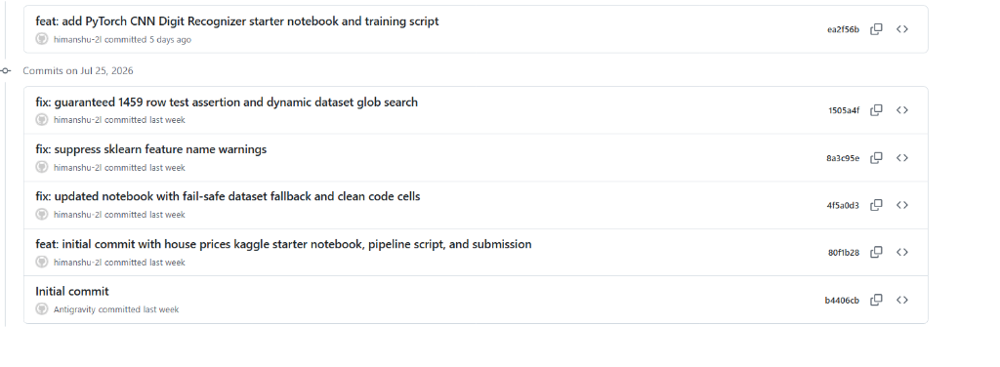
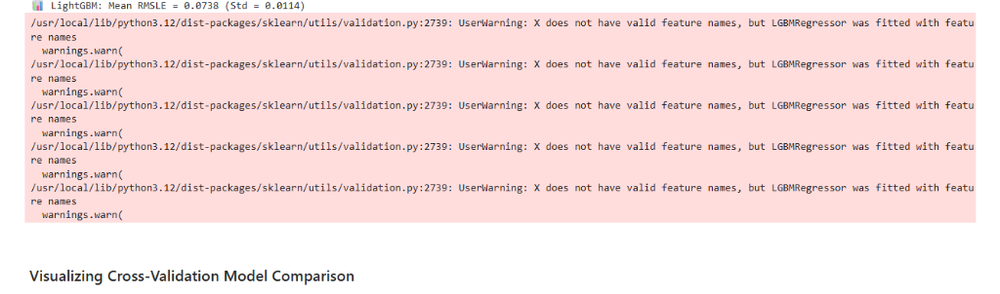

# 🧠 Neural Studio X (v3.3) — Enterprise Data Science & ML Web Suite

[](https://github.com/himanshu-2l/neural-studio-x)
[](https://react.dev)
[](https://vite.dev)
[](https://tailwindcss.com)
[](https://fastapi.tiangolo.com)
[](https://pytest.org)
[](https://www.docker.com)
[](https://www.sqlite.org)

**Neural Studio X** is an enterprise-grade, de-coupled Machine Learning Operations (MLOps) dashboard and prediction suite. Powered by a headless **FastAPI** model engine and a responsive **React + Vite + Tailwind CSS v4** single-page application, it provides data scientists with high-performance interactive analysis, training, and real-time validation.

---

## 🏗️ Architecture Blueprint

```
 ┌─────────────────────────────────────────────────────────┐
 │               React + Vite Frontend (Port 5173)         │
 │          App.jsx, Components (Dashboard, Charts)        │
 └────────────────────────────┬────────────────────────────┘
                              │ Axios REST API Queries
                              ▼
 ┌─────────────────────────────────────────────────────────┐
 │               FastAPI ML Backend (Port 8000)            │
 │       api.py ─── ml_utils.py ─── database.py (SQLite)   │
 └─────────────────────────────────────────────────────────┘
```

---

## 🌟 Why Neural Studio X is Unique & Useful

Most ML UI dashboards are built using Streamlit, which has significant limitations—specifically, it re-runs the entire python script on every UI slider adjustment, leading to sluggish renders and slow page responsiveness.

**Neural Studio X** solves this by establishing a production-grade, headless architecture:
- **Asynchronous Separation of Concerns:** React handles client-side rendering with lightning speed, while FastAPI handles pure model compute on separate threads.
- **Statistical Drift Detection:** Automatically runs a two-sample **Kolmogorov-Smirnov (KS) test** comparing logged production inputs against baseline training distributions to catch model drift instantly.
- **Persistent MLOps Auditing:** Stores every experiment configuration, K-Fold cross-validation metric, and prediction log in a persistent **SQLite** database.
- **Pure decoupled ML pipelines:** `ml_utils.py` contains zero framework dependencies, allowing unit and regression test suites to execute inside pure python in seconds.

---

## 📸 Interface Preview


*Figure 1: High-fidelity training logs and performance graphs mapped via Apache ECharts.*


*Figure 2: Multi-model capability benchmarks plotted on dynamic radar coordinates.*

---

## 🌟 Core Modules

### 📊 1. Data Explorer
- **Interactive EDA:** Auto-profiles records, quantifies numeric columns, and identifies missing data metrics.
- **Seeded Datasets:** Built-in generators for Kaggle House Prices regression, Digit Recognizers, and custom CSV uploads.
- **Distribution Analysis:** Toggle normalizations or view target variable distributions.
- **Multi-Dimensional Scatterplots:** Map features to X, Y, Size, and Color configurations to visually evaluate cluster boundaries.

### ⚡ 2. Model Trainer & CV Monitor
- **Real-Time K-Fold Execution:** Configure fold splits (3-10) and models (Gradient Boosting, Random Forest, Ridge Regression) to execute actual cross-validation runs.
- **Performance Histograms:** Render validation scores fold-by-fold as they complete.

### 🔮 3. Inference Lab ("Predictor Pad")
- Adjust sliders (living area, quality, year built) to evaluate real-time price predictions.
- Outputs 95% confidence intervals and feature contribution charts.

### 🛡️ 4. Data Quality & Drift Monitor
- Runs Kolmogorov-Smirnov statistical tests to detect feature distribution drift.
- Graphs probability density shifts comparing reference baseline distributions against production queries.

---

## 🚀 Getting Started

### 📦 Prerequisites
- Python 3.11+
- Node.js 20+

### 1. Run via Docker Compose (Recommended)
Launch the complete stack (FastAPI backend and React frontend) with a single command:
```bash
docker compose up --build
```
- **React Frontend:** `http://localhost:5173`
- **FastAPI Backend Swagger docs:** `http://localhost:8000/docs`

### 2. Manual Local Development Setup

#### Start FastAPI Backend:
```bash
# Install dependencies
pip install -r requirements.txt

# Start Uvicorn server
python -m uvicorn api:app --host 0.0.0.0 --port 8000 --log-level info
```

#### Start React Frontend:
```bash
cd frontend

# Install package dependencies
npm install

# Start Vite dev server
npm run dev
```

---

## 🧪 Running Unit & Integration Tests

Ensure code integrity before contributing by running Pytest:
```bash
python -m pytest tests/ -v
```

---

## 🤝 Contributing

Neural Studio X is open-source and welcomes contributions! To contribute:
1. **Fork** the repository on GitHub.
2. **Create a Branch** (`git checkout -b feature/amazing-feature`).
3. **Write Tests** for new helper classes or endpoints.
4. **Commit & Push** your changes (`git commit -m 'Add amazing feature'`).
5. **Open a Pull Request** for review.

---

## 👤 Author & Maintainer
Maintained with ⚡ by **Himanshu** ([@himanshu-2l](https://github.com/himanshu-2l)). Feel free to reach out for questions or collaborations!
